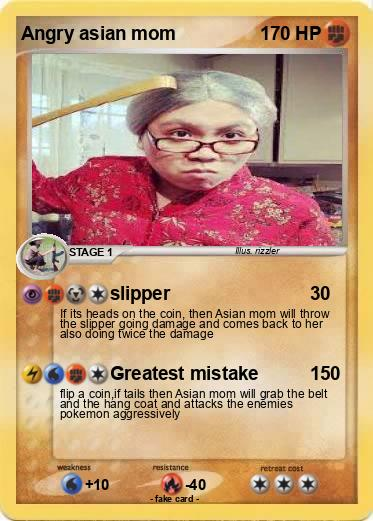
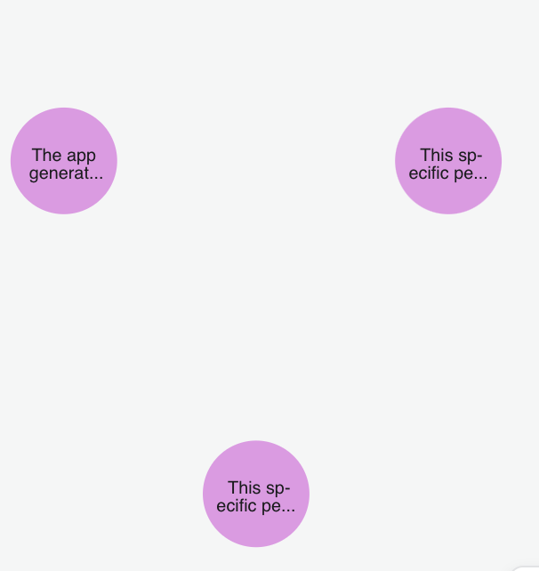
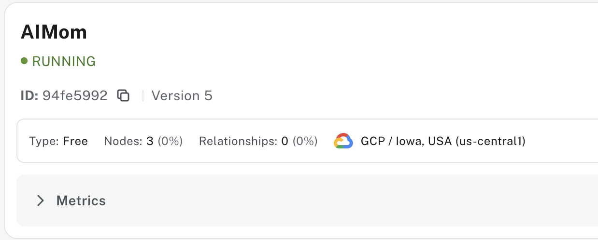

# MomAI – The AI Reminder Bot That Acts Like Your Mother!

## Mom AI - Choose your mom!





## Moms Use neo4j





## Moms Use BAML

```
// Defining a data model.
class Reminder {
  reponse string
}

function GetReminder(momPrompt: string, todo: string) -> Reminder {
  // Specify a client as provider/model-name
  // you can use custom LLM params with a custom client name from clients.baml like "client CustomHaiku"
  client "openai/gpt-4o-mini" // Set OPENAI_API_KEY to use this client.
  prompt #"
    Before anything else, review the following prompt for instructions:
    {{ momPrompt }}

    Now, given the following scheduled task, generate a reminder from your role:
    {{ todo }}

    {{ ctx.output_format }}
  "#
}
```


